# sdd-toolkit

Moova's **Spec-Driven Development** toolkit. It bundles the agents, skills and slash
commands for the OpenSpec workflow so any repo can share the exact same setup, and
pull updates centrally when the toolkit changes.

## Prerequisites

- **Node >= 18** (to run the installer via `npx`).
- **OpenSpec CLI** — the OpenSpec commands this toolkit ships need it installed. See the docs at
  <https://openspec.dev/>, or install it directly:

  ```bash
  npm install -g @fission-ai/openspec@latest
  ```

## What it ships

| Category | Assets |
|----------|--------|
| **Agents** | `spec-reviewer` — independent reviewer of an OpenSpec change (the plan); `code-reviewer` — independent reviewer of the implementation diff (the code) |
| **Skills** | `openspec-propose`, `openspec-apply-change`, `openspec-archive-change`, `openspec-explore` |
| **Commands** | `/ticket` (idea → grounded draft → create ticket), `/implement` (ticket → branch → OpenSpec → spec review → code → code review), `/opsx:*` |
| **Tickets** | Per-system profile + template. Natively supported: `jira`, `trello` (default: `jira`). Any other value installs a generic fallback you wire up by hand. |
| **Scaffold** | `openspec/config.yaml` starter (copied once, you fill it in) |

## The workflow

The assets encode one chain, from a plain-language idea to an open PR. Two **independent,
fresh-context reviews** frame the implementation — `spec-reviewer` validates the *plan* before
any code is written, `code-reviewer` validates the *code* before it becomes a PR — and the flow
**stops for a human** (🛑) at every irreversible or outward-facing step.

```mermaid
flowchart TD
    A([Idea in plain language]) --> T1["/ticket &lt;idea&gt;"]

    subgraph TICKET["/ticket — draft &amp; create the ticket"]
        T1 --> T2["Clarify the idea<br/>(ask if ambiguous)"]
        T2 --> T3["Ground it in the codebase<br/>read CLAUDE.md/AGENTS.md + explore real modules"]
        T3 --> T4["Draft using ai-specs/ticket-template.md"]
        T4 --> T5{{"🛑 Human approves the draft"}}
        T5 -->|requests changes| T4
        T5 -->|approves| T6["Create via ai-specs/ticket-system.md"]
    end

    T6 --> K([Ticket created: key + URL])
    K --> I1["/implement &lt;key&gt;"]

    subgraph IMPL["/implement — implement the ticket"]
        I1 --> I2["Read the ticket<br/>(ai-specs/ticket-system.md)"]
        I2 --> I3["Pre-flight git<br/>clean tree, fetch default branch"]
        I3 --> I4{{"🛑 Confirm branch name"}}
        I4 -->|approves| I5["git checkout -b &lt;branch&gt;<br/>from origin/default — includes the key"]
        I5 --> I6["/opsx:propose<br/>proposal.md · design.md · tasks.md"]
        I6 --> I7["spec-reviewer<br/>independent review of the PLAN<br/>(fresh context)"]
        I7 --> I8{{"🛑 Human approves the artifacts<br/>(with the review in hand)"}}
        I8 -->|requests changes| I6
        I8 -->|approves| I9["/opsx:apply<br/>implement tasks, [ ]→[x]"]
        I9 --> I10["code-reviewer<br/>independent review of the CODE/diff<br/>(fresh context) + optional /security-review"]
        I10 --> I11{{"🛑 Human approves the code<br/>(with the review in hand)"}}
        I11 -->|requests changes| I9
        I11 -->|approves| I12["Wrap up · lint · final task progress"]
    end

    I12 --> P1{{"🛑 Commit / push only when you ask"}}
    P1 --> P2["git push + open PR<br/>per the repo's conventions"]
    P2 --> PR([PR opened])
    P2 -.-> AR["/opsx:archive<br/>(once the change is done)"]

    style TICKET fill:#eef6ff,stroke:#4285f4
    style IMPL fill:#f0fdf4,stroke:#34a853
    style T5 fill:#fff4e5,stroke:#f5a623
    style I4 fill:#fff4e5,stroke:#f5a623
    style I8 fill:#fff4e5,stroke:#f5a623
    style I11 fill:#fff4e5,stroke:#f5a623
    style P1 fill:#fff4e5,stroke:#f5a623
```



The reviews feed back: an `APPROVE-WITH-CHANGES` / `REJECT` verdict loops back to fix the
artifacts (spec) or the code before asking for approval. Creating the ticket and opening the PR
are outward-facing — the flow never does them without your say-so.

## Install into a repo (once)

From the root of the target repo:

```bash
npx github:moovaio/sdd-toolkit init
```

Defaults to `--agents=claude --tickets=jira`. Override either:

```bash
npx github:moovaio/sdd-toolkit init --agents=claude --tickets=trello
```

`--tickets` accepts a natively-supported system (`jira`, `trello`) or **any other name**. If it's
not supported (e.g. `--tickets=osticket`), the installer still proceeds: it prints a warning with
the manual steps and installs a generic fallback profile at `ai-specs/ticket-system.md` for you to
fill in. Those fallback files are yours — `update` never overwrites them.

Then commit `ai-specs/`, `.claude/` and `.sdd-toolkit.json`. The whole team gets the
setup by cloning — nobody else needs to run the command.

## Update to the latest toolkit version

```bash
npx github:moovaio/sdd-toolkit update            # apply
npx github:moovaio/sdd-toolkit update --dry-run  # preview what would change
```

`update` reads `.sdd-toolkit.json`, refreshes the **managed** assets, and reports
`old -> new` version. Your scaffold files and OpenSpec content are never touched.

## How it works

- **Managed assets** (agents / skills / commands) are the real files, kept in `ai-specs/`
  inside the repo. `update` overwrites them — treat them like a dependency, don't edit in place.
- **Tool dirs** (`.claude/`) are **symlinks** into `ai-specs/`, so updating the real file
  updates what every agent tool reads. No duplication.
- **Scaffold files** (`openspec/config.yaml`) are copied once and never overwritten.
- **Config** lives in `.sdd-toolkit.json`: `{ version, agents, ticketSystem }`.

```
your-repo/
  ai-specs/                    # managed source of truth (committed)
    agents/{spec-reviewer.md,code-reviewer.md}
    skills/openspec-*/
    commands/{implement.md,opsx/*}
    ticket-template.md         # resolved from the chosen ticket system
  .claude/                     # symlinks -> ai-specs/
    agents/…  skills/…  commands/…
  openspec/config.yaml         # scaffold (yours to fill)
  .sdd-toolkit.json
```

## Extending

- **New agent tool** (e.g. Cursor): add an entry to `AGENT_TOOLS` in `bin/init.js`
  mapping the tool's dir and the categories it consumes, then consumers set
  `--agents=claude,cursor`.
- **New ticket system** (e.g. Linear): add a `template/ai-specs/tickets/<system>/` folder with
  `ticket-template.md` and `ticket-system.md` (how `/implement` reads a ticket), and consumers set
  `--tickets=<system>`. Dirs starting with `_` are internal (the `_unsupported` fallback), not
  selectable systems. Consumers who need a one-off system don't have to wait for this — they can pass
  any `--tickets=<name>` and edit the generic fallback profile in their repo.
